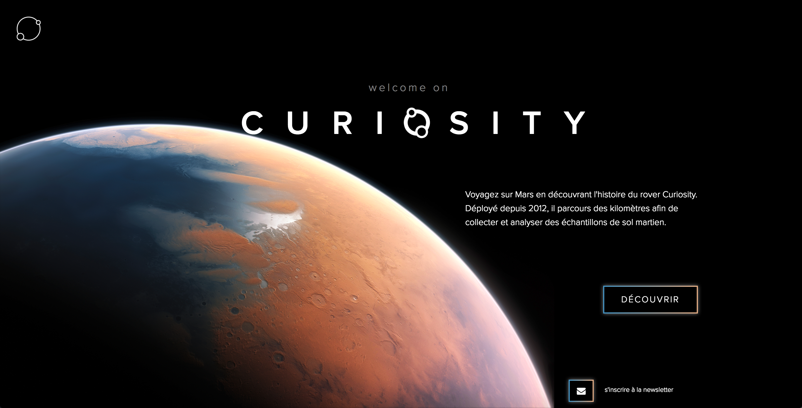
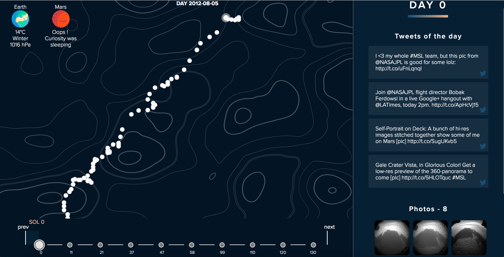
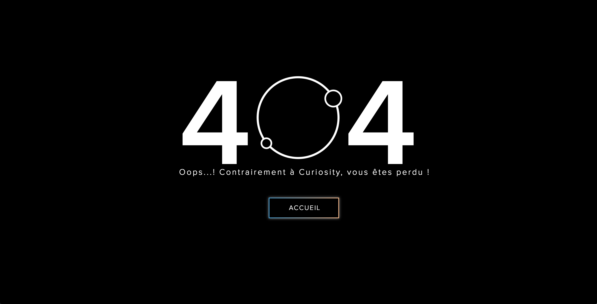
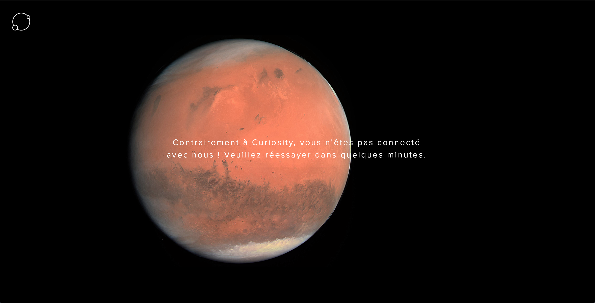

# Curiosity
<table>
	<tr>
		<td>
			Our project is based on the Mars Curiosity Rover.  We used an API to get the path of the Rover from the beginning of his mission until today and we drew it by cluster of 10 days.  
			With the data from the MAAS API (Mars Weather API), we compare the weather between Mars and Earth from the day selected.  
			With the data from the Mars Rover Photos API, we display all the photos taken by the front camera of the rover from the day we selected.  
			With the Tweeter API, we display tweets of the Curiosity tweeter account from the day we selected.
		</td>
	</tr>
</table>

## Screen

## Features
- Routing
- Rewriting URL
- Cache avec base de données
- Comparaison de la météo entre Mars et la Terre en fonction du jour sélectionné et de la localisation du visiteur (limitée par l’API)
- Navigation à travers les jours (par 10 environ) via une timeline reliée à la map
- Affichage de point clé de son chemin tout les 10 jours environ avec des informations spécifiques à ce jour au survol
- Affichage des photos de Curiosity en fonction d’une période spécifique (Mars) 
- Affichage des tweets de Curiosity en fonction d’une période spécifique (Terre) 
- Lightbox pour profiter pleinement des photos
- Zoom pour profiter de la map
- Aucune dépendance externe
- Pas de librairie utilisée

## Demo
A live Demo is coming soon, stay in touch...

## Install locally
- npm install in terminal
- Connect in localhost with MAMP

### Bug

If you find a bug , open an issue [here](https://github.com/BaptisteVillain/spaceAPI/issues).

## Built with

- HTML
- CSS
- JS
- PHP

## Team

||||

HETIC ©
